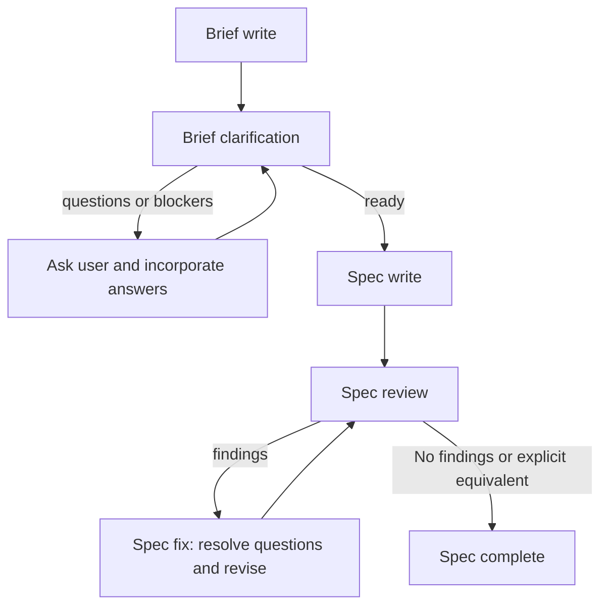
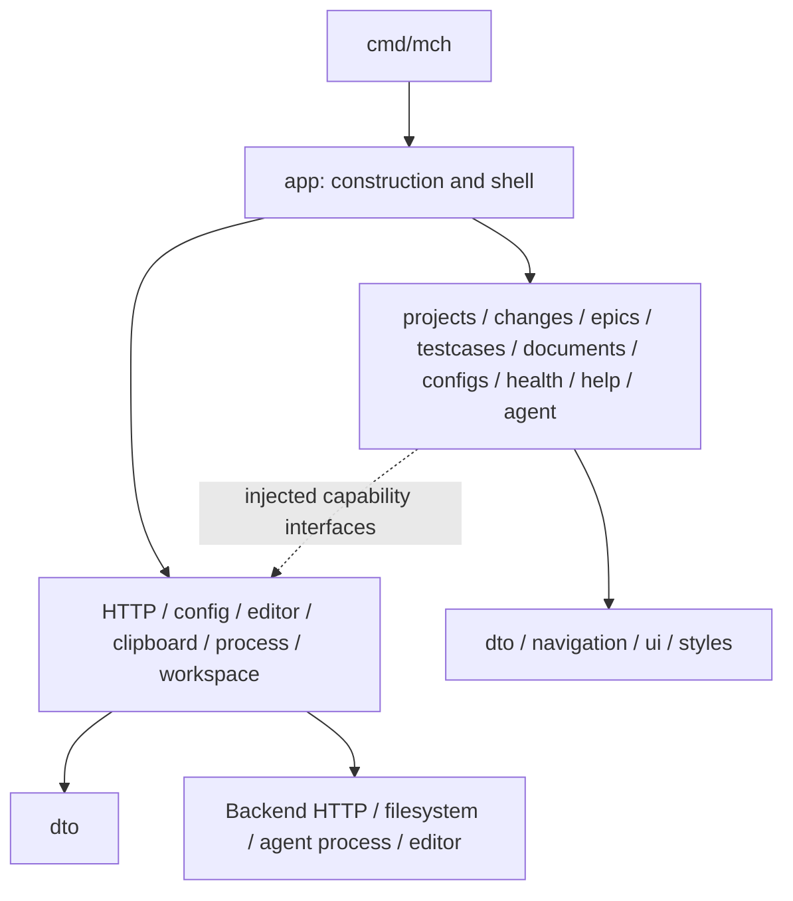

# CLI Architecture

This document defines the target architecture for the `mch` terminal application.
The CLI provides access to every current backend API operation and exactly one
agent-assisted workflow: brief write → brief clarification → spec write →
spec review → spec fix → spec review, repeating review/fix until `No findings`
or an equivalent explicit successful-review signal. The existing configurable
Flow system and all other agent workflows must be removed.

These are implementation requirements, not a claim that the current code already
meets them. This change establishes the architecture document; implementation
and removal work must be tracked separately.

Paths are relative to `cli/` unless explicitly repository-relative. The executable
is named `mch`; the Go module and import prefix are `cli`. The separate
[`cli-proto/`](../cli-proto/) module is a prototype, not a second implementation to
extend or a dependency of the CLI.

## Product scope

Ordinary API operations are available independently of the agent workflow. Users
can manage projects, epics, changes, testcases, documents, and configurations and
check backend health without launching an agent or creating Flow resources.
“Available” means a discoverable CLI action with inputs, results, and errors, not
merely an unused client method.

### Changes list interaction

The Changes list shows `/phase-filter`, `/types-filter`, `/epic-filter`, and
`/find-filter` in its filter summary. These four filters persist while opening a
change, returning to Main, reentering the list, and switching projects.
`/clear-filters` clears all four; `@clear` in the Phase, Types, or Epic selector
clears only that filter. A blank Find entry or canceled editor retains the
saved query. Typing ordinary text in the list prompt applies an additional
temporary word-prefix search until the prompt is cleared or the user leaves the
list. The list restores the selected change when returning from its details
screen. The ordinary active-list menu omits `/retry` and `/brief-new`; returning
to Main and opening `/changes` reloads that list. The inactive list exposes
`/retry` to reload inactive changes without repeating activation. Epic cells show
the epic name without an ID suffix. Types uses AccentPurple, while `%` and
Complete use AccentBlue.

Use `brief` and `spec` consistently in commands, screens, data types, and prompts.
Remove the legacy `def` terminology and its compatibility paths. Other configured
document types remain accessible through ordinary document API actions; their
availability does not introduce additional agent workflows.

### The single brief-to-spec workflow

| Step | Responsibility and completion condition |
| --- | --- |
| 1. Brief write | Accept the user's intent as editable `brief` text for a new or existing change. Preserve the original input. |
| 2. Brief clarification | The agent rewrites the brief for clarity while preserving intent, asks concrete questions about ambiguities and obstacles, incorporates answers, and repeats until no unresolved issue prevents writing the spec. Do not invent requirements or silently resolve material ambiguity. |
| 3. Spec write | The agent writes `spec` from the clarified brief, the user's answers, and relevant project/repository context. Do not silently expand scope. |
| 4. Spec review | The agent checks the current spec for ambiguity, contradictions, omissions, and obstacles to implementation. Return findings or an explicit successful-review result. Findings advance to spec fix; only a successful review completes the workflow. |
| 5. Spec fix | The agent addresses the review findings, asks the user questions where a decision is needed, incorporates answers, and revises the spec. Always return to spec review after fixing; repeat review/fix until the review explicitly reports `No findings` or its defined equivalent. |



The controller owns this fixed sequence, the brief clarification loop, and the
spec review/fix loop. Spec review and spec fix are distinct phases. Model
phases, pending questions, answers, findings, document versions, and operation
status explicitly. Waiting for an answer is a first-class state: no timeout,
missing answer, or agent-process success may be interpreted as a resolution.
A finding records the issue, its affected text, and its resolution; do not infer
“no findings” from an empty or malformed agent response. Normalize a valid review
result into either findings or an explicit success status tied to the reviewed
spec revision. A successful fix, exhausted retry count, or process exit code is
not a successful review; interrupted or blocked loops remain incomplete.

Users must be able to inspect the current brief/spec, answer questions, edit the
text, and cancel. A changed brief invalidates downstream spec/review results;
changed spec text invalidates the previous review. Bind results to the input
revision so late output cannot mark a newer document complete. An interruption
or failed save retains useful draft text and unresolved questions and must not
advance the workflow.

The workflow ends at the reviewed spec. It does not implement code, run code
reviews or fixes, generate PRs, create branches, commit, push, merge, or deploy.
Do not add a configurable stage engine, alternate flows, or generic agent chat as
another workflow. Repository inspection may supply context; repository automation
is not a stage of this feature.

### Legacy removal

Remove the old Flow system rather than adapting its stage definitions:

- Flow YAML, help catalogs, stage modes, task statuses/steps, entry/exec/exit hooks,
  and Flow Makefile dispatch.
- The repository's `.mch/default/` Flow templates, prompts, and scripts, including
  code, PR, merge, deployment, and branch/commit automation. Retain dedicated brief/spec instructions at repository-relative
  `.mch/default/prompts/{brief-rewrite,brief-resolve,spec-write,spec-review,spec-fix}.md`,
  per the approved resource override. Preserve `.mch/config.yaml` and `.mch/tmp/`.
- Old `def-write`, `spec-write`, `pr-write`, review/chat command families, generated
  shared `change-types.md`, and legacy artifact/session restoration conventions.
- Flow-specific UI states, commands, help, configuration types, compatibility
  branches, documentation, and tests that enforce removed behavior.

Review repository-wide references when removing these assets. Do not retain a
hidden old runner behind renamed commands or keep the CLI dependent on
`.mch/default/flow.yaml`. Preserve useful HTTP, editor, process, and terminal
mechanics only as general adapters with tests for the new behavior. Removing
obsolete tooling does not authorize deleting existing user documents or workspaces.

## Current implementation and migration baseline

The following describes existing code to assess and replace where it conflicts
with the target above. Existing Flow behavior is not a compatibility requirement.

| Location | Current responsibility |
| --- | --- |
| [`cmd/mch/main.go`](../cli/cmd/mch/main.go) | Pass arguments and output to `app.Run`, print errors, and set the exit status. |
| [`internal/app/`](../cli/internal/app/) | Startup, repository configuration, root model, navigation, commands, forms, selectors, HTTP orchestration, editor and clipboard access, and editor orchestration; legacy agent coordination is removed. |
| [`internal/changes/`](../cli/internal/changes/) | Change list/detail state, filtering, artifact parsing, rendering, command names, and an API interface. |
| [`internal/projects/`](../cli/internal/projects/) | Project state, rendering, command names, and an API interface. |
| [`internal/epics/`](../cli/internal/epics/), [`internal/testcases/`](../cli/internal/testcases/), [`internal/help/`](../cli/internal/help/) | Screen helpers and command/navigation definitions; epic and testcase models are currently empty. |
| `internal/agent/` (P8–P9) | Legacy implementation removed in P1; the fixed controller and injected process adapter remain to be implemented. |
| [`internal/dto/`](../cli/internal/dto/) | Shared CLI data structures, mixing backend data and presentation values. |
| [`internal/navigation/`](../cli/internal/navigation/) | Screen identifiers and transition helpers. |
| [`internal/ui/`](../cli/internal/ui/), [`internal/styles/`](../cli/internal/styles/) | Shared terminal layout, tables, and styling. |
| [`pkg/client/http.go`](../cli/pkg/client/http.go) | Backend HTTP calls, permissive JSON decoding, and selector mapping. |
| [`integration/`](../cli/integration/) | Complete-program tests, import-boundary checks, and terminal tests. |

Startup parses `--version` or launches the interactive application; there are no
subcommands. It resolves the Git repository root (without reading or changing branch
state) and loads only `.mch/config.yaml`. `RunProgramWithIO` accepts an explicit
repository root, context, input/output and program lifecycle callback for tests,
bypassing Git lookup. Startup requires no Flow resources, agent executable, prompt
generation, or workspace creation.

Local configuration is file-only: `backend_url` is required, `project_id` defaults
to zero (prompt for selection). Environment variables and `cli/.config/config.yaml`
do not override or replace it. Missing/malformed config errors identify the path
and affected key before launching the terminal. `/config` renders the in-memory
resolved config, with no filesystem reads. Selection takes effect immediately;
asynchronous saves serialize and atomically replace the file through a sibling
temporary file. Failure preserves the previous file and selected project in memory,
and explicitly reports that local persistence failed. Orderly keyboard exits wait
for in-flight and queued configuration saves; input is paused while saves drain.
A save failure cancels automatic exit so the error remains visible; the user can
then select again to retry or explicitly exit.

The root model implements `Init`, `Update`, and `View`. HTTP work is generally
returned as `tea.Cmd` functions that produce typed result messages. The root
`Update` handles those messages and routes keyboard events. Feature packages are
currently mostly helpers rather than independently managed screen models.

Editor processes use `tea.ExecProcess` so the terminal can be handed to the editor
and restored. Failed editor saves retain the raw returned bytes separately from
the textarea display. Enter retries that draft as literal data; Ctrl+E reopens it,
and an unchanged reopen still retries an unsaved draft. Ctrl+C clears the draft.
Drafts that the textarea cannot represent exactly must be edited with Ctrl+E;
representable drafts remain editable in the prompt without becoming slash commands.
Existing ordinary API reads/edits remain pending the typed transport
and feature migrations P2–P7. `/new-change` currently performs ordinary creation
through the editor and existing API; it invokes no agent. Epic placeholder saves,
example data, and unimplemented project deletion are no longer offered as working
actions. The fixed brief/spec controller, process adapter, and scripted progress UI
return in P8–P9. Existing user workspaces are preserved but never restored as legacy
sessions. The obsolete agent→changes parser dependency is removed with that path.

## Target package boundaries

Keep features visible in the directory structure. Do not copy the backend's
API/service/repository layers into a terminal client: the CLI's boundaries are
presentation, user workflows, and external effects.



The dashed edge is a runtime collaboration, not a feature import of a concrete
adapter. Construct adapters at startup and inject them into their consumers.

### Application shell

`internal/app` owns program construction, terminal size and focus, the active
screen, global commands, project selection, and routing between features. It
composes screen output and routes typed results between features. The fixed
brief-to-spec controller lives in `internal/agent`, not in the root model.

Move feature-specific forms, validation, API sequencing, and result handling to
the owning feature. A change-field save belongs to `changes`; testcase CRUD
belongs to `testcases`, even when displayed inside change details. Agent execution
belongs to `agent`. Add `internal/documents` for document reads/history/insertion,
`internal/configs` for backend configuration management, and `internal/health` for
health diagnostics. The workflow uses injected document capabilities to save its
brief/spec versions; ordinary document screens use the same backend contract.
Keep local configuration loading separate from the `configs` feature.

`cmd/mch` remains a small process boundary. Only it chooses the process exit code.
Feature code returns errors and messages rather than printing or calling
`os.Exit`.

### Feature packages

A feature owns its state, input handling, rendering, and user operations. Use
files such as `model.go`, `update.go`, `view.go`, and `commands.go` when they have
real responsibilities. `api.go` may define the small backend capability interface
consumed by that feature; it is not an HTTP handler layer.

Keep pure transformations, artifact parsing, and validation independent of
Bubble Tea where practical. The brief-to-spec controller must be testable without
a terminal or live agent. Its question/answer and review transitions are behavior,
not presentation details.
Do not create empty models, empty interfaces, or forwarding layers for symmetry.

Features must not import `app`. Coordinate sibling features through the shell
and typed messages rather than reaching into one another's models. Shared
packages must not import features or the shell. `ui` and `styles` contain reusable
presentation code; `dto` and navigation transition data must remain independent
of terminal widgets and external effects.

### External adapters

Keep HTTP mechanics in `pkg/client`. Extract configuration loading, editor,
clipboard, process, and workspace effects from presentation code into focused
adapters as those boundaries are refactored. Reusable infrastructure belongs in
`pkg`; the fixed brief-to-spec controller lives under
`internal/agent`. Its five prompts remain under repository-relative
`.mch/default/prompts/` per the approved user resource override. It uses an injected runner, not repository Flow scripts.

Adapters must not import the application shell or screen packages. They own
external-library calls and resource cleanup, and accept explicit dependencies
such as an HTTP client, repository root, or process runner. Use consumer-owned
interfaces where substitution is needed for tests; avoid duplicating the entire
backend interface in both `pkg/client` and the shell.

## Event loop and operation lifetime

`Update` changes model state and returns commands. `View` only renders. Network,
filesystem, clipboard, and process work must execute outside rendering and the
synchronous update path. Commands capture the inputs for one operation and
return results; they must not mutate a captured model or package-global state.

Each asynchronous result must identify the relevant project/entity and operation.
A result from a previous selection or an older request must not overwrite the
current screen. Keep loading, success, failure, and cancellation explicit. Use
`tea.Batch` only for independent work; sequence dependent mutations and reads.

Pass the program's context into HTTP requests and noninteractive subprocesses.
Cancel owned work on exit, and cancel or disregard obsolete reads on navigation.
Use a finite HTTP timeout. Agent runs need an explicit lifetime and cancellation
policy rather than an unrelated HTTP timeout or `context.Background()`.
Interactive processes must preserve terminal restoration through Bubble Tea's
process handoff.

Progress readers publish messages through a bounded, cancellation-aware channel.
Only `Update` changes visible state. Closing the UI must not leave a blocked
sender, an unbounded output buffer, or a subprocess running without an owner.

## Backend contract and data ownership

The backend owns persisted business data and integrity. The CLI talks to its
HTTP API; it must not access PostgreSQL or import backend internal packages.
Use the current backend handlers and request/response definitions as the
executable contract, with [backend architecture](backend-architecture.md) as
the design reference.

The client follows the current backend contracts. Historical assumptions are
listed here to make the migration explicit:

| Existing CLI assumption | Current backend contract and target client behavior |
| --- | --- |
| `/project/get` and `/change/get` | Use `/project/details` and `/change/details`. All paths in this table are below `/api/v1`. |
| Global `/options/change-phases-list` and `/options/change-types-list` | Fetch `/project/config` with the selected project's ID. Use its configured phases, colors, types, and document types. |
| Create/insert returns a complete entity | Decode HTTP `201` and the created ID, or the slug for config insertion; explicitly load details if the screen needs them. |
| Update returns a complete entity | Accept HTTP `204` without decoding an entity; explicitly refresh the relevant reads. Delete also returns `204`. |
| Definition, spec, PR, and agent-edit state are fields of a change | Read documents through `/doc/list-active`, `/doc/list`, or `/doc/details`; append document versions through `/doc/insert`. `agent_edit` belongs to the document. |
| Change creation sends `def` | Send the backend's `brief` field and use “brief” in the CLI. |
| Testcase mutations return an updated change with embedded testcases | Use `/test-case/list` and separate change/details reads as needed. Mutations return an ID or no content. |
| `/change/assign-flow` assigns identity | That route is removed. Read persisted identity from current change responses; do not reconstruct an obsolete operation in the client. |

See the backend [project](../backend/internal/project/api.go),
[change](../backend/internal/change/api.go), [doc](../backend/internal/doc/api.go),
and [testcase](../backend/internal/testcase/api.go) handlers and their
[domain types](../backend/internal/domain/).

Use typed JSON requests and responses for these contracts. Replace recursive
`map[string]any` envelope searches and alternate field-name guesses. A malformed
response is a contract error, not an empty successful list. Wire DTOs must model
numeric IDs, nullable relationships, timestamps, and response fields accurately;
convert them to display strings and selector options at the presentation boundary.
Keep transport-only DTOs private to the adapter where possible. Shared values
crossing feature boundaries belong in `internal/dto`; screen-only rows stay local.

One transport method represents one HTTP operation. User actions and the single
agent workflow may compose separate calls. For example, saving a title sends the update, records that the
save succeeded, and then refreshes details. If the read fails, show “saved;
refresh failed” and allow another read. Do not label a committed mutation as a
failed save or retry the write automatically. Multi-call workflows are not atomic;
preserve created IDs and completed steps when later steps fail.

Keep HTTP status and underlying causes available in errors. Presentation decides
how to display them. Never automatically retry creates or document insertions
without an established idempotency contract.

## Complete API access

The following inventory comes from the current backend route registrations.
Every in-scope row is required in both the typed HTTP adapter and a reachable CLI action.
Inactive epic browsing is deferred; it is outside specification 031.
All listed operations use `POST` under `/api/v1`, except the two `GET` health
routes. Keep this inventory and CLI action/contract tests aligned when routes
change.

| Feature | Backend operations | Required CLI access |
| --- | --- | --- |
| Projects | `/project/list`, `/project/details`, `/project/create`, `/project/update`, `/project/delete`, `/project/config` | Browse, inspect, create, edit, delete, and inspect the project's resolved configuration. |
| Epics | `/epic/list`, `/epic/details`, `/epic/create`, `/epic/update`, `/epic/delete` | Full epic management within a project, including details and completion data. |
| Changes: reads and lifecycle | `/change/list`, `/change/list-inactive`, `/change/details`, `/change/create`, `/change/delete` | Browse/filter, inspect, create from a brief, and delete independently of the agent workflow. |
| Changes: associations | `/change/update-epic`, `/change/update-after-change` | Set or clear the epic and prerequisite change, preserving nullable values. Details show plain `epic_name` and `after_change_name`; the latter editor uses `after_change_id` and starts blank for null. |
| Changes: fields | `/change/update-phase`, `/change/update-active`, `/change/update-types`, `/change/update-title`, `/change/update-slug`, `/change/update-pr-url` | Explicitly edit each supported field, including clearing values where the API permits it. Slug updates send only the lowercase suffix; list and details read the full `ref_slug`. |
| Testcases | `/test-case/list`, `/test-case/create`, `/test-case/update`, `/test-case/update-done`, `/test-case/delete` | List, create, edit, mark done/undone, and delete testcases for a change. |
| Documents | `/doc/list`, `/doc/list-active`, `/doc/details`, `/doc/insert`, `/doc/delete`, `/doc/active-set`, `/doc/comment-list`, `/doc/comment-insert`, `/doc/comment-update`, `/doc/comment-undelete` | Browse history, read selected active documents, inspect, append, delete and activate the same retained non-comment ID. Comments use independent insert/update/delete/undelete operations. Owner catalogs apply to non-comment inserts. |
| Configurations | `/config/list`, `/config/details`, `/config/insert`, `/config/update`, `/config/delete` | Manage configurations by slug and edit all six catalog arrays, including explicit empty arrays. |
| Health | `GET /api/v1/health`, `GET /api/health` | Show API/database status and degraded errors; allow selection of either supported route from the health action. |

Backend sources: [epics](../backend/internal/epic/api.go),
[configurations](../backend/internal/config/api.go),
[health](../backend/internal/health/api.go), and the handlers linked above.

Forms must expose every field supported by the relevant request DTO and display
returned data without guessing missing values. Config slugs are immutable; updates
identify the existing slug. Configuration writes require all six arrays, with
empty arrays distinct from omitted/null values. Document insertion appends a
version; do not invent document update/delete endpoints. PR URL editing and manual
PR document insertion remain ordinary API actions, not agent PR generation.

Each action needs discoverable help, loading/error handling, and meaningful
success feedback. An API capability is incomplete if only its transport method
exists or if a visible screen still performs navigation-only placeholder saves.
Shared endpoint mechanics do not justify hiding uncommon operations.

## Configuration and document persistence

Repository configuration supplies the backend address and selected project.
Backend project configuration supplies business catalogs and document types.
There is no Flow configuration source. Load local settings before launching the
terminal UI and inject resolved values; normal API use must not require an agent
executable, Flow files, a workspace, or a Git branch.

Project configuration must be loaded after project selection and refreshed when
that selection changes or its configuration is edited. Missing configuration is
an actionable error; do not substitute a global/default catalog. Scope caches to
the model and project. Pass the selected project's relevant context directly to
the agent operation instead of generating shared prompt files.

Persist local project selection atomically and report write failures without
losing the in-memory selection or implying it was saved. Keep repository-root
resolution separate from the HTTP client and ordinary API operations.

The backend is authoritative for saved brief/spec documents. For a new change,
`/change/create` stores the initial `brief` and returns the change ID. For an
existing change, read its current documents explicitly. Save subsequent brief
and spec versions using `/doc/insert` with `ref_table: change`, the change ID,
`doc_type: brief` or `spec`, and the correct `agent_edit` provenance. Agent rewrites
must not erase the original user-authored brief. Require the selected project's
configuration to support the needed document types; report missing `brief`/`spec`
support without inventing a fallback type or modifying configuration silently.

Questions, answers, findings, and controller phases are workflow session state;
they are not backend change phases or newly invented API fields. Retain them with
the relevant document revision during the session. If local recovery is provided,
use a dedicated session format for this fixed workflow and revalidate backend
versions before resuming. Do not reuse the old Flow stage/session protocol.

If the runner/editor needs files, allocate an operation-owned scratch directory.
Local drafts are recoverable working copies, not a replacement for API persistence.
Keep useful output after failure and report which writes succeeded. Cleanup must
validate directory ownership and remove only files created by that operation;
refusing to reuse a directory must leave its existing files intact. Do not replace
an unrelated regular file at an expected directory path.

## Verification

Follow the [repository test requirements](../AGENTS.md), including meaningful
unit tests for each acceptance-criterion bullet and unit statement coverage of at
least 80%. Include every CLI production package when measuring coverage; terminal or
agent integration results do not establish unit coverage. Record actual covered
and total statements, package gaps, failures, and skipped scenarios.

Use complementary checks:

- Pure unit tests cover parsing, filtering, state transitions, validation, and
  partial-success behavior.
- Adapter tests use `httptest` and temporary directories to check exact routes,
  payloads, status handling, malformed responses, cancellation, and cleanup.
- Complete-program tests exercise startup, navigation, editing, and shutdown with
  injected runners and I/O. Keep fake-server fixtures aligned with the current
  backend contract rather than preserving removed endpoints.
- Workflow tests use a scripted fake agent to cover the five phases, repeated
  brief questions, unanswered blockers, review findings, spec fixes, multiple
  review/fix cycles, explicit successful-review results, malformed review output,
  stale results, cancellation, and partial persistence. Verify that spec writing
  cannot start with unresolved brief blockers, every fix returns to review, and
  only an explicit successful review of the current spec revision can complete
  the workflow.
- API action/contract tests cover every route in the inventory, all editable
  request fields, and ordinary API access without legacy Flow resources or an
  agent executable. Verify old Flow commands and startup dependencies are gone.
- Remove legacy Flow-script tests alongside the removed scripts; replace relevant
  behavior coverage with tests of the fixed controller and general adapters.
- PTY tests verify terminal handoff, redraw, color, and scrolling. The existing
  terminal suite requires `socat` and skips when it is unavailable; report that
  skip explicitly.
- Architecture tests check actual module imports and fail on forbidden edges.
  Test the checker with a deliberately forbidden import so a stale prefix cannot
  turn enforcement into a no-op.

For live backend validation, use only a designated development/test server and
isolated records. HTTP fakes prove client behavior against fixtures, not live
compatibility. Backend APIHydra validation remains governed by `AGENTS.md`.

The current CLI Makefile needs repair before `make -C cli check` can be treated as
a reliable gate: `PKG` is `mch` although the module is `cli`; `lint` runs modifying
`goimports -w`; tools are installed with `@latest`, with `goimports` omitted; and
the Docker default is Go 1.25 despite `go.mod` requiring 1.26.0. Separate formatting
from checks, pin tools, derive package/toolchain selection from the module, and
fail if package discovery fails or yields no production packages.

Until those targets are repaired, these direct commands select the actual module
when run from `cli/`:

```sh
go list ./...
go build -o /tmp/mch-cli ./cmd/mch
go vet ./...
go test -count=1 -short ./internal/... ./pkg/...
go test -count=1 -race ./internal/... ./pkg/...
go test -count=1 ./integration
go test -count=1 -v ./integration/terminal/...
```

These commands are not a coverage gate or a substitute for lint. For this
documentation change, local links, API route inventory, module/package discovery,
Make dry runs, a CLI build, and `mch --version` were checked. Application suites
and coverage were not run or measured.

## Implementation priorities

1. Remove the legacy Flow engine, assets, commands, configuration dependencies,
   and obsolete tests. Keep ordinary API startup independent of agent resources.
2. Align the HTTP adapter and DTOs with the backend and expose every operation in
   the API inventory through a complete, tested CLI action.
3. Implement the single brief-to-spec controller, its question/answer UI, document
   persistence, and explicit spec review/fix loop. Use dedicated prompts and an
   injected runner.
4. Move feature behavior out of the root model. Propagate cancellation, reject
   stale results, scope catalogs to projects, and enforce scratch-file ownership.
5. Repair Make targets and import-boundary enforcement. The existing architecture
   test checks `mch/internal/` and lists `domain` as shared, while the code uses
   `cli/internal/` and `dto`; a passing result currently cannot prove the boundary.

Contract migration and removal of old workflows change behavior. Review them
against this scope rather than treating old Flow tests as acceptance criteria.
Track progress in change specifications/checkpoints; this target document is not
evidence that the implementation or API migration is complete.

## Change document presentation and history

Project responses use `config_slug` and `active`; epic responses use `active`.
Change details use `active`, while change-list rows have neither `active` nor
`open`. `/active` sends an explicit boolean to `change/update-active`.
Project/epic deletion may deactivate referenced records; refresh and report the
returned state rather than assuming physical removal from a 204 response.

The selected project's ordered `change_docs` defines Docs slots, including
`brief` and excluding `comment`. Selection comes solely from `doc/list-active`; document
rows contain nullable `deleted_at` and no wire `current` flag. Duplicate active
types or different owners are contract errors. Docs use checkboxes and local update timestamps. Testcases use checkboxes and
scenario/ID text. Comments are independent records printed on one line with
newlines replaced by spaces; editors and viewers retain the full stored bodies.
`/new-comment` is the first detail command and requires no document catalog.
Human inserts send `agent_edit: false`; comment updates retain the same ID and
send explicit bodies, including an empty string. Delete opens the bottom purple
`Are you sure?` menu with `yes` / `no`; cancellation sends no mutation.

H or Ctrl+H opens the selected type's retained history, including deleted records;
the empty Comments row provides access when no comments remain live. Left/Right
browse newer/older IDs without wrapping. Metadata sits immediately under the
header: local `created_at`, `updated_at`, and optional red `deleted_at`.
All displayed timestamps use `2006-01-02 15:04` after local-time conversion.
Change details show Created and Modified together in the Timestamps row, with
document update times beside their slots. Timestamps use AccentCyan, small checks
AccentGreen, docs/testcases AccentWhite, and the bold completion summary AccentBlue.

The document process adapter writes the exact full Markdown body to an owned
file and captures `bat -pp --color=always <file>` with separate arguments.
The history viewport preserves bat syntax ANSI colors while clipping, scrolling
and resizing. Space selects the same historical non-comment ID through
`doc/active-set`, or restores the same deleted comment through
`doc/comment-undelete`. Live comments and already selected documents are no-ops.
Esc/Ctrl+C returns with the originating selection. Process/HTTP failures remain
visible; `/retry` reads and prints without replaying committed mutations.
`/documents` retains project/epic/change access and uses this history viewer.

Ctrl+H on the change list opens project-scoped inactive changes. Space activates
an inactive row; if its refresh fails, `/retry` reloads only the inactive list
without replaying activation. Esc/Ctrl+C returns to the originating list. Change
epic selectors exclude inactive epics. Revision, owner and project checks reject late
HTTP/editor/process results; menu and editor focus owns its keys.

## Selected change item actions and terminal selection

Change details present ID, Epic, Phase, Types, Active, Timestamps, Title, Docs,
Testcases, Completed, Comments, After Change, Ref UUID, Slug and PR URL in that
order, with section dividers and a scrollable body. ID stays visible when the
viewport has room. Enter opens the editor for a selected doc, testcase or comment;
Space opens a selected doc or comment's full current body through the bat adapter
and a scrollable viewer.
Escape/Ctrl+C returns from viewing or history to the originating selection.
Delete confirms before mutating a saved item. Space toggles selected testcase
completion and Active. Comments show `<modified_at> - <body>` on one line;
timestamps are AccentCyan and bodies use pure-white Foreground (`#FFFFFF`),
including when selected. Saved Docs show `<modified_at> - [✓] <type>` with cyan
timestamps, pure-white text and green checkmarks. Docs always reserve a 16-column
timestamp and separator, so missing timestamps and empty slots keep checks aligned.
Doc/comment timestamps use AccentPurple when their local date is today, and
AccentCyan otherwise. The slug value is AccentGreen, including when selected.
Footer help follows the selected row.
H/Ctrl+H on a testcase reports that history is unavailable: the backend currently
stores only current testcases. This is the user-approved temporary behavior.

Every screen reserves exactly one error line between the prompt and footer,
colored AccentRed. Long errors preserve the beginning and end with an ellipsis;
control characters cannot escape the line. The program does not capture mouse
input, allowing native terminal double-click selection and the terminal's
Ctrl+Shift+C copy binding without a modifier to bypass application capture.
